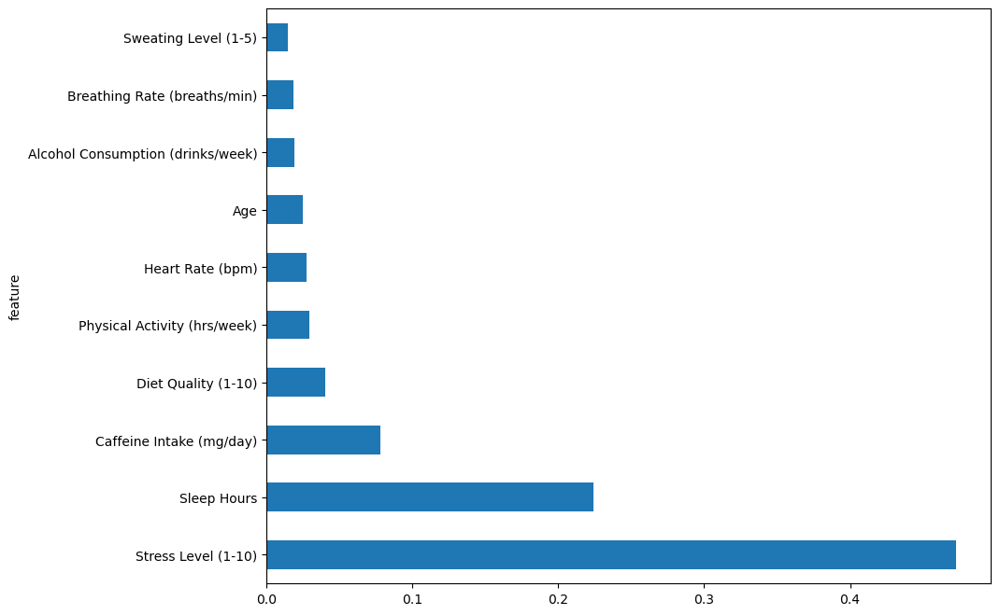

# SOCIAL ANXIETY PROJECT

## PROBLEM STATEMENT 
With over 5 million Kenyans struggling with anxiety disorders, MindGuard revolutionizes mental health through an intelligent early-warning system. Using Feedforward Neural Networks to interpret complex behavioral patterns, MindGuard detects anxiety risks and delivers personalized preventative interventions, helping individuals maintain optimal mental wellness before clinical intervention becomes necessary.

## OBJECTIVES
1. Can we create an intelligent early-warning system that accurately predicts who is likely to experience anxiety problems, allowing for timely prevention and support?

2. How can we provide personalized lifestyle recommendations that are most likely to help individuals reduce their anxiety risk based on their unique profile?

3. Which lifestyle factors have the biggest impact on anxiety and how can these insights guide effective prevention strategies and public health initiatives?

## OVERVIEW  
Our project aims to develop machine learning models using ensemble methods (Random Forest, Gradient Boosting) and Feed-Forward Neural Networks to interpret complex behavioral patterns from lifestyle and physiological data.

We aim to create an accurate prediction system that identifies individuals at risk of developing anxiety before clinical intervention becomes necessary, while providing personalized preventative interventions tailored to individual profiles.

Our methodology involves comprehensive analysis of lifestyle factors including stress levels, sleep patterns, caffeine intake, and diet quality to identify the most impactful predictors for anxiety prevention. The ultimate goal is to deploy interpretable models in digital health platforms that can deliver personalized lifestyle recommendations and guide effective prevention strategies for optimal mental wellness.

## STEPS
- Exploratory Data Analysis(EDA) 
- Data Preprocessing
- Model Building (Random Forest Classifier & Feedforward Neural Network)
- Model Interpretation 
- Model Deployment

### Feature Importances
  Clearly shows the Random Forest model focuses on behavioral attributes(stress, sleep, caffeine) over physiological ones(HeartRate, BreathingRate).

  

## MODEL INTERPRETATION

### Early detection of Anxiety using Random Forest Classifier
#### Interpretations 
High Accuracy (82%): Indicates the model successfully distinguishes between individuals with low and high anxiety.

Precision (Low Anxiety) = 0.87: The model is very reliable when it predicts someone does not have high anxiety—good for avoiding false alarms.

Recall (High Anxiety) = 0.70: About 70% of those with high anxiety are correctly identified, which is decent but leaves room for improvement.

F1-score (High Anxiety) = 0.71: Balanced performance in predicting high-risk individuals.

##### Confusion Matrix 

The model is excellent at identifying low-anxiety cases, is suitable for low-stakes screening.

It is effective for preliminary screening but requires tuning for clinical use. Focus on reducing FNs (missed high-risk cases) through threshold adjustment and class rebalancing. Always validate with domain experts to align with healthcare priorities.

##### ROC curve 

AUC (Area Under Curve) = 0.89, which indicates very strong classification ability.
This means there's an 89% chance that the model will correctly distinguish between a randomly chosen positive case (high anxiety) and negative case (not high anxiety).

Clinical utility: This performance level suggests the model could be clinically useful for anxiety screening

Threshold selection: The steep initial rise in the curve indicates you can achieve high sensitivity without too many false positives by choosing an appropriate threshold

#### Insights
Slight Recall Imbalance: Could indicate:

Class imbalance (fewer high-anxiety cases).

Need for SMOTE or weighted loss.

Random Forest Strength: Works well with non-linearities and feature interactions—ideal for psychological data with complex dependencies.

Feature Contribution: Lifestyle data alone allows fairly strong early detection, emphasizing the value of behavioral data for screening purposes.
### Personalized recommendations(regression)
#### Key Model Interpretations:
R² = 0.77: The model explains 77% of the variance in anxiety scores across individuals. This is a strong indicator of model generalization.

RMSE = 1.03: On a 1–10 scale, the average prediction error is around 1 point—acceptable for psychological risk prediction.
#### Insights
Non-Linearity Captured: Anxiety is not always linearly related to factors like age or caffeine. RF handles this with ease, making predictions robust.

Feature Flexibility: By combining lifestyle and physiological data, the model gives a more holistic view of each individual, enabling nuanced recommendations.

Personalization: You can reverse-engineer the score and provide users with:

“You are scoring 7.2 due to high stress and low sleep.”

“Improving sleep from 4h to 7h could reduce your risk score by ~1.1.”
### Lifestyle Analysis: Feature Importance
#### Interpretations
Stress Level (0.47): Core driver of anxiety — confirms psychological theory. Strongest single predictor in both classifier and regressor.

Sleep Hours (0.22): Inadequate sleep strongly elevates anxiety. Tailored sleep hygiene interventions can be highly effective.

Caffeine Intake (0.08): Stimulants like caffeine exacerbate anxiety—important for behavioral recommendations.

Diet Quality (0.04): Poor nutrition subtly contributes to anxiety—likely via energy, gut-brain axis, or inflammation.

#### Insights
Interventions can be personalized based on individual feature profiles:

High caffeine + low sleep = focus on stimulants and rest.

High stress + poor breathing = recommend mindfulness, yoga, or CBT.

Explainable AI Opportunity: With SHAP values, you can show users exactly which features pushed their score up/down—enhancing trust and transparency.

#### Feedforward Neural Network (FNN)

#### Predicted vs. Actual plot

Tight clustering around the red diagonal line (perfect prediction line) shows:

Strong alignment between predicted and actual values.

Model is well-calibrated.

Consistent spread across the anxiety scale (1–10):

Indicates the model is not biased toward low or high anxiety scores.

Vertical scatter (residuals) is minimal:

Suggests good accuracy with few large errors.

### Interpretations across all models.
Model Agreement
All ensemble models (Random Forest, Gradient Boosting) perform well, suggesting:
The signal in the data is strong and consistent.
Non-linear interactions dominate (e.g., stress x sleep, age x caffeine).

FNN also performs well (R² = 0.75), confirming deep learning can learn useful patterns even from moderate-sized tabular data.

Model Robustness
Random Forest has low variance and bias due to its averaging approach.

The regressor’s consistent performance across test sets suggests it can be safely deployed for real-world prediction (if retrained on production data).

Health Insight Integration
The model’s importance rankings correlate with clinical/psychological literature—validating its practical utility and trustworthiness.

## CONCLUSION 
This project successfully demonstrates the potential of machine learning models—specifically ensemble methods like Random Forest and Gradient Boosting—in the early detection, risk prediction, and personalized recommendation of anxiety prevention strategies. 

By leveraging a combination of lifestyle and physiological data, we have built interpretable, high-performing models capable of supporting real-world mental health interventions.

This work demonstrates that machine learning can meaningfully contribute to mental health awareness and early intervention. The models developed here can be embedded into digital health tools to provide users with:

Early warning signs of potential anxiety disorders.

Risk scores tailored to their personal lifestyle and physiology.

Recommendations for behavioral change targeting high-impact factors such as stress management, sleep hygiene, and caffeine reduction.
